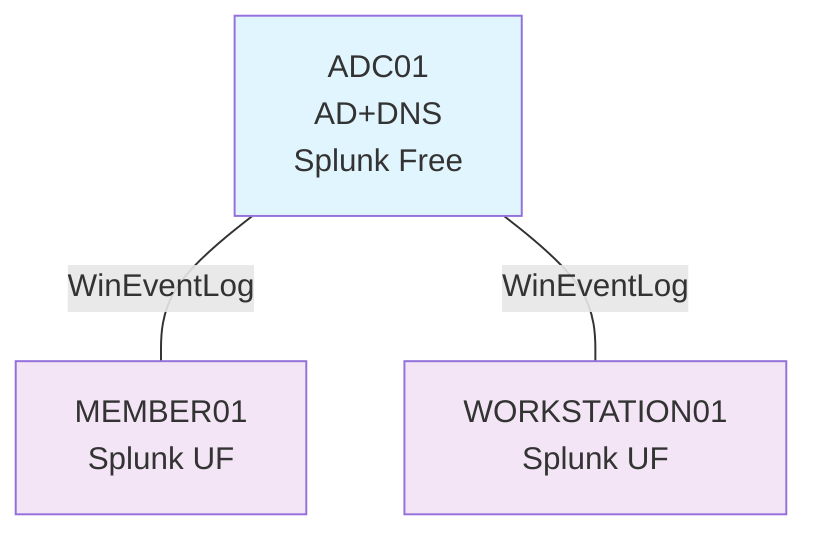

```mermaid
graph TD;
    DC1[ADC01<br/>AD+DNS<br/>Splunk Free]
    C1[MEMBER01<br/>Splunk UF]
    C2[WORKSTATION01<br/>Splunk UF]
    
    DC1 --- |WinEventLog|C1
    DC1 --- |WinEventLog|C2
    
    style DC1 fill:#e1f5fe
    style C1 fill:#f3e5f5
    style C2 fill:#f3e5f5

```
