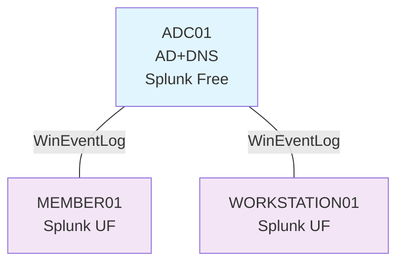

# 公務員CSIRTのAD攻撃検知ラボ

## 目的
公務員CSIRT経験者として、民間企業CSIRTリーダー転職を見据えた**AD攻撃→Splunk検知の実務代替ラボ**を構築

このリポジトリは、3台構成のADラボ上で PsExec を用いた横移動（TA0008）を検知し、5分以内に封じ込める一連の流れを再現することを目的としています。

## このラボで検証している検知

- PsExec による ADMIN$ 共有アクセス（Event ID 5145）
- PSEXESVC サービス作成による横移動実行（Event ID 7045）
- 日本語 / 英語 Windows イベントログ両対応のフィールド正規化（ShareName, ServiceName など）
- Splunk ダッシュボードによる 5145 → 7045 攻撃チェーンの可視化

03-dashbords/にスクリーンショットがあります。
過去24時間の PsExec 横移動検知数を Single Value で表示し、5145 → 7045 の攻撃チェーンを下部テーブルで色分け表示します。


## 構成


DC1: AD DS / DNS / Splunk (Windowsログ集約・検知)

MEMBER01: ドメイン参加サーバ（横移動の標的）

WORKSTATION01: ドメイン参加クライアント（攻撃元想定）


## プレイブック

- [01-AD横移動検知・封じ込めプレイブック](./02-playbooks/01-AD-lateral-movement.md)  
  - 対象: WORKSTATION01 → MEMBER01 間の PsExec 横移動  
  - 使用クエリ: `PsExec LATERAL MOVEMENT DETECTION` ダッシュボード内の検索と同一


## ステータス

- ✅ PsExec 横移動（5145/7045）の検知とダッシュボード化
- ✅ 5分以内封じ込めプレイブック（netsh隔離 + sc delete）
- ⏳ 4624/4776 を使ったログオン経路トレース（別プレイブックとして追加予定）


## 環境構成(メモ)
ホスト:AMD RYZEN7 + RAM 32GB + VMware
VM1:Windows Server 2022 ADC01(adc01.local)
VM2:Windows Server 2022 MEMBER01(ファイルサーバー)
VM3:Windows11 WORKSTATION01(社員ＰＣ)
    各VMのネットワークはホストオンリーとする


Splunk:Enterprise Free(ログ解析)
ADC01(192.168.2.130)
    Splunk Enterprise(Indexer+Search Header)
    Universal Forwader → MEMBER01/WORKSTATION01
    Windows Event Log(Security/System)収集
MEMBER01(192.168.229.137)
    Universal Forwader → ADC01送信
    Defenderログ
WORKSTATION01(192.168.2.132)
    Universal Forwader → ADC01送信
    Powershell BlockRule

## Splunkの導入
1. splunk.comからsplunkenterpriseをダウンロードしインストール
2. splunk.comからsplunkforwaderをダウンロードしインストール
3. firewall設定でoutboundとinboundの該当ポートを許可
    outbound:9997を許可
    inbound:8089を許可
    **Indexerの場合はinboundに9997の許可が必要**
4. splunkにログインし「設定」の「転送と受信」から「受信の設定」に入り、9997番ポートを追加する
5. outputs.confで転送先を設定する
今回は以下の設定（C:\Program Files\SplunkUniversalForwarder\etc\system\local\outputs.conf）
```
[tcpout]
defaultGroup = splunk_indexer

[tcpout:splunk_indexer]
server = 192.168.2.130:9997

[forwarder]
indexAndForward = false

```
6. inputs.confで取得するデータを設定する
今回は以下の設定（C:\Program Files\SplunkUniversalForwarder\etc\system\local\inputs.conf）
```
[WinEventLog://Security]
disabled = 0
start_from = oldest
index = windows
sourcetype = WinEventLog:Security

[WinEventLog://System]
disabled = 0
start_from = oldest
index = windows
sourcetype = WinEventLog:System

[WinEventLog://Application]
disabled = 0
start_from = oldest
index = windows
sourcetype = WinEventLog:Application
```
7. splunkforwaderを再起動する
コマンドプロンプトでprogramfiles\splunkforwader\bin\に移動し、以下コマンドを実行
```
splunk restart
```
8. インデックスの設定
splunkにログインし、「設定」から「インデックス」を選択し、新規インデックス(windows)を作成する。
9. splunkを再起動する
コマンドプロンプトでprogramfiles\splunk\bin\に移動し、以下コマンドを実行
```
splunk restart
```
10. splunkにログインしサーチからイベントログが取れているかを確認する。