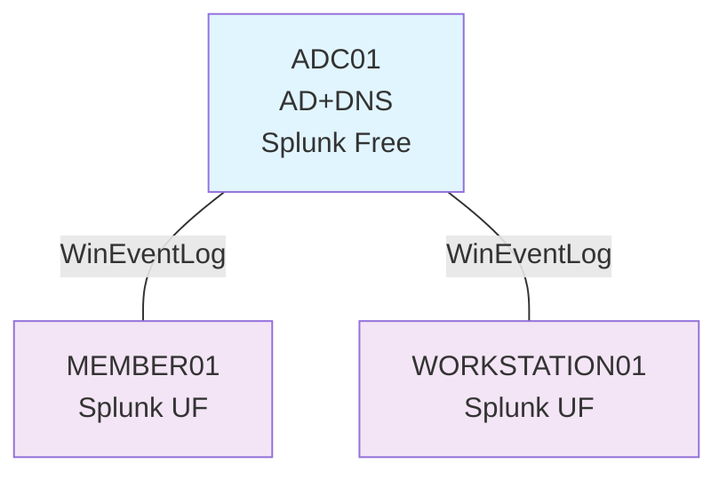

# 公務員CSIRTのAD攻撃検知ラボ

## 目的
公務員系CSIRTの経験者として、民間企業CSIRTリーダー転職を見据えた**AD攻撃→Splunk検知の実務代替ラボ**です。

このリポジトリは、3台構成のADラボ上で PsExec を用いた横移動（TA0008）を検知し、5分以内に封じ込める一連の流れを再現することを目的としています。

## このリポジトリの読み方

時間がない方向けのおすすめ閲覧順は以下の通りです。

1. 本 README（目的とラボ構成の概要）
2. `03-dashboards/` のスクリーンショット
3. `02-playbooks/01-AD-lateral-movement.md` の検知シナリオと対応手順
4. 必要に応じて `01-lab/` の構築メモ（再現したい場合）

## このラボで検証している検知

- 対応タクティクス：TA0008 Lateral Movement
- 対応テクニック例：T1570,T1021.002
- PsExec による ADMIN$ 共有アクセス（Event ID 5145）
- PSEXESVC サービス作成による横移動実行（Event ID 7045）
- 日本語 / 英語 Windows イベントログ両対応のフィールド正規化（ShareName, ServiceName など）
- Splunk ダッシュボードによる 5145 → 7045 攻撃チェーンの可視化

03-dashbords/にスクリーンショットがあります。
過去24時間の PsExec 横移動検知数を Single Value で表示し、5145 → 7045 の攻撃チェーンを下部テーブルで色分け表示します。

## 構成

 - DC1: AD DS / DNS / Splunk (Windowsログ集約・検知)

 - MEMBER01: ドメイン参加サーバ（横移動の標的）

 - WORKSTATION01: ドメイン参加クライアント（攻撃元想定）

## ダッシュボード

- `PsExec LATERAL MOVEMENT DETECTION`（03-dashboards/）
  - 過去24時間の PsExec 横移動検知数を Single Value で表示（1件以上で赤表示）
  - 下部テーブルで 5145（ADMIN$ アクセス）→7045（PSEXESVC サービス作成）の攻撃チェーンを色分け表示
  - 日本語 / 英語 Windows イベントログ両対応のフィールド正規化を実装

## プレイブック

- [01-AD横移動検知・封じ込めプレイブック](./02-playbooks/01-AD-lateral-movement.md)  
  - 対象: WORKSTATION01 → MEMBER01 間の PsExec 横移動  
  - 使用クエリ: `PsExec LATERAL MOVEMENT DETECTION` ダッシュボード内の検索と同様ｌ
  -  成功条件：PsExec実行から５分以内にダッシュボードで検知→攻撃元ホスト隔離→PSEXESVCサービス削除まで 
  - 公務員系CSIRTでの運用経験をもとに、民間企業CSIRTリーダー職向けに AD 攻撃検知とインシデント対応スキルを示すための実践ラボです。
  - 成功条件：PsExec実行から５分以内に、ダッシュボードで検知→攻撃元ホスト隔離→PSEXESVCサービス削除まで完了

## ステータス

- ✅ PsExec 横移動（5145/7045）の検知とダッシュボード化
- ✅ 5分以内封じ込めプレイブック（netsh隔離 + sc delete）
- ⏳ 4624/4776 を使ったログオン経路トレース（別プレイブックとして追加予定）

## ラボ環境（概要）

- ホスト:AMD RYZEN7 / 32GB RAM / VMware
- ゲスト:
 - VM1:Windows Server 2022 ADC01(ドメインコントローラ / Splunk Indexe)
 - VM2:Windows Server 2022 MEMBER01(ファイルサーバー / UF)
 - VM3:Windows11 WORKSTATION01(クライアント / UF)
- ログ収集：
 - 各ホストからADC01上のSplunk EnterpriseへWinEventLog(Security/System/Application)を転送

 詳細なセットアップ手順は[01-lab/SPLUNK_SETUP.md](./01-lab/SPLUNK_SETUP.md)を参照してください。